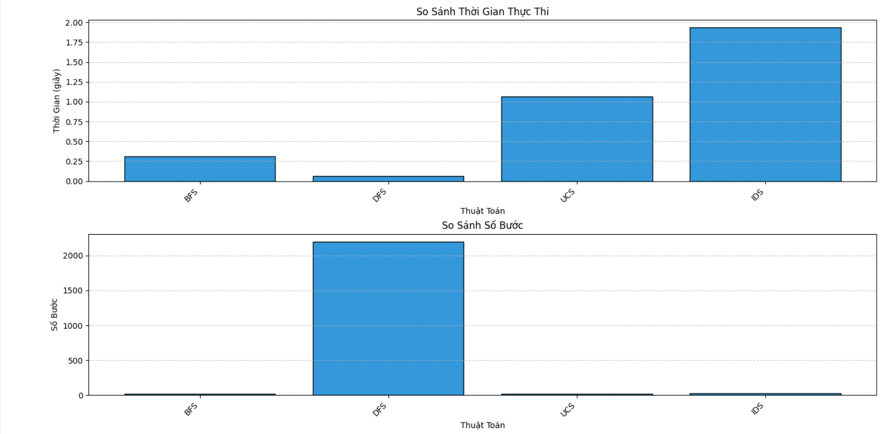
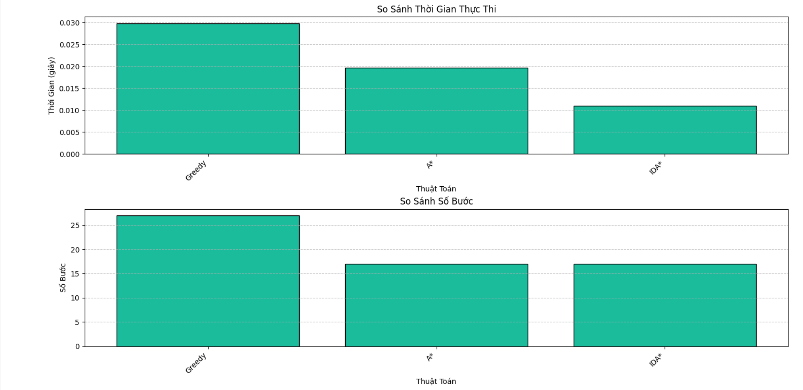
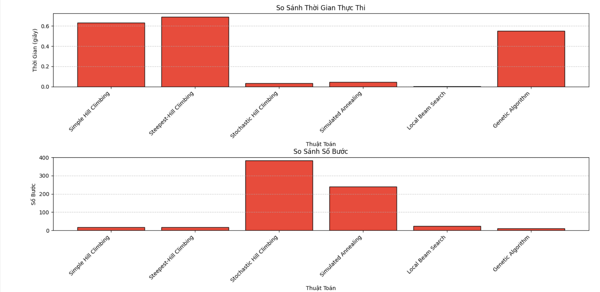
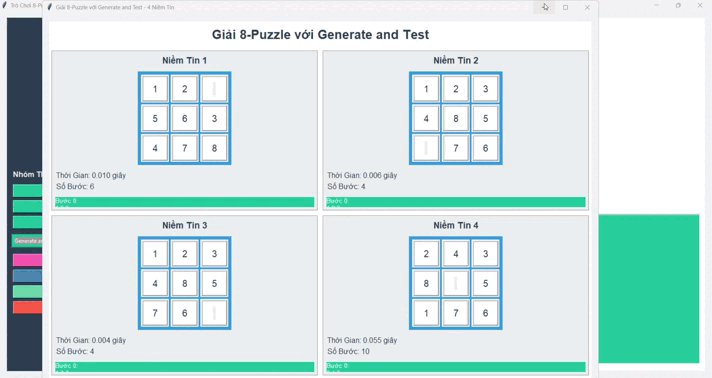
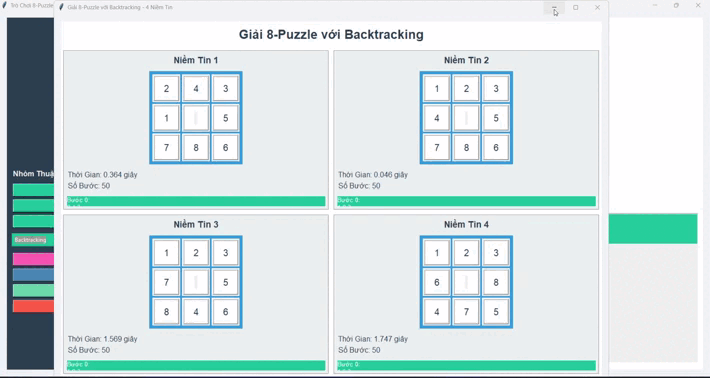
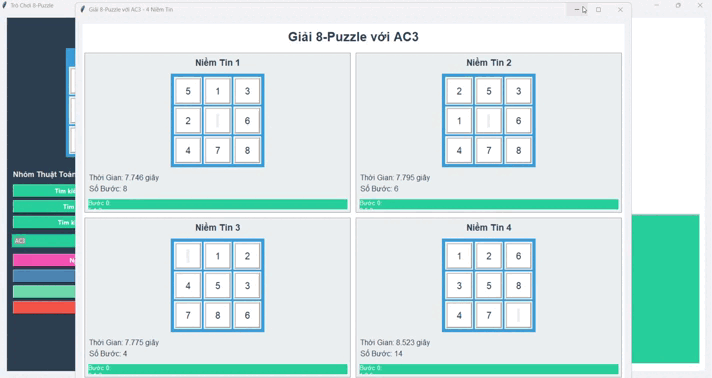
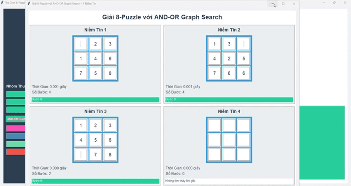
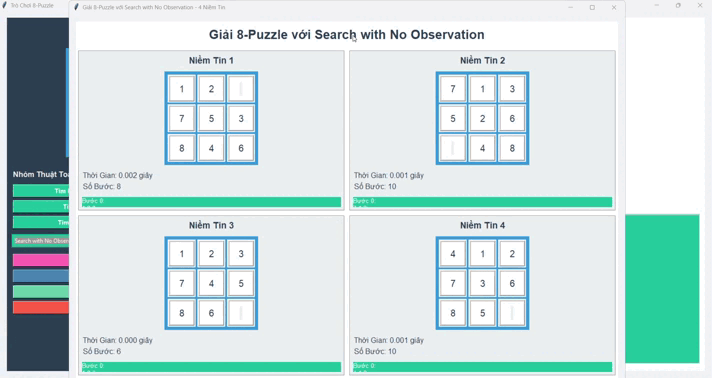
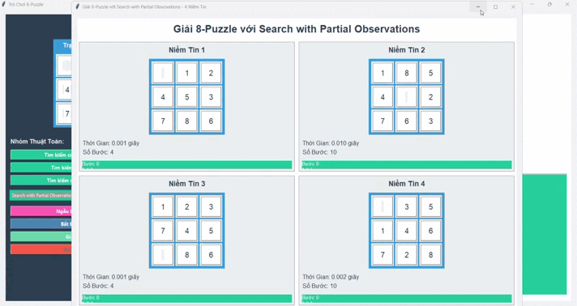
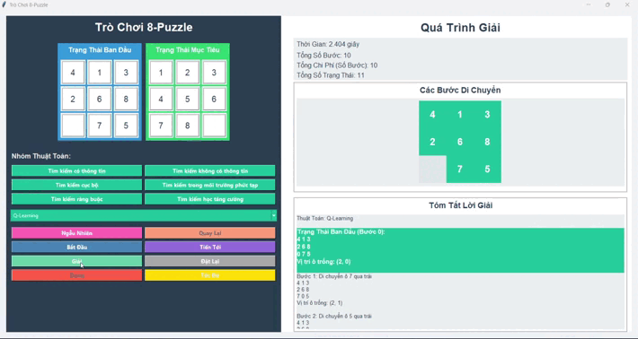

# ✨ĐỒ ÁN CÁ NHÂN MÔN TRÍ TUỆ NHÂN TẠO: Phân tích & ứng dụng các Thuật toán Tìm kiếm trên Bài toán 8 Ô Chữ✨

## 📚 Giới thiệu

Báo cáo này trình bày kết quả nghiên cứu và triển khai các thuật toán tìm kiếm cơ bản và nâng cao trong lĩnh vực Trí tuệ Nhân tạo. Dự án cá nhân này tập trung vào việc phân tích cơ chế hoạt động, đặc điểm lý thuyết và đánh giá hiệu quả hoạt động của các thuật toán này khi áp dụng trên bài toán kinh điển **8 ô chữ (8-Puzzle)**, một ví dụ điển hình cho bài toán tìm kiếm trạng thái. Nội dung báo cáo tóm tắt này được trình bày dựa trên cấu trúc yêu cầu của đề bài.

---

## 🎯 1. Mục tiêu

Các mục tiêu chính mà dự án hướng tới bao gồm:

- Nắm vững **cơ chế hoạt động** và **đặc điểm lý thuyết** của các nhóm thuật toán tìm kiếm đa dạng.
- Áp dụng thành công các thuật toán tìm kiếm vào việc giải **bài toán 8 ô chữ**.
- **Đánh giá định lượng và định tính** hiệu suất của các thuật toán (thời gian, bộ nhớ sử dụng, số lượng nút thăm) khi chạy trên 8 ô chữ thông qua các thực nghiệm.
- Tổng hợp và trình bày kết quả nghiên cứu một cách **trực quan và khoa học** trong báo cáo này.

---

## 📖 2. Nội dung Chi tiết

Phần này đi sâu vào từng nhóm thuật toán đã nghiên cứu, làm rõ cách chúng hoạt động và hiệu quả trên bài toán 8 ô chữ.

### 🧩 Bài toán 8 Ô Chữ: Định nghĩa Tìm kiếm

Trước khi đi vào từng thuật toán, hãy cùng định nghĩa các thành phần của bài toán 8 ô chữ dưới góc độ bài toán tìm kiếm:

- **Không gian trạng thái:** Tập hợp tất cả các cấu hình (cách sắp xếp) có thể có của 8 viên gạch số và 1 ô trống trên bảng 3x3.
- **Trạng thái ban đầu:** Cấu hình ban đầu của bảng (thường là ngẫu nhiên hoặc do người dùng cung cấp).
- **Hàm chuyển trạng thái:** Các hành động di chuyển ô trống (lên, xuống, trái, phải) nếu hợp lệ, dẫn đến cấu hình bảng mới (trạng thái mới).
- **Trạng thái đích:** Cấu hình bảng mà các ô số được sắp xếp theo thứ tự mong muốn.
- **Chi phí bước đi:** Thường là 1 cho mỗi nước đi.
- **Lời giải:** Một chuỗi các hành động hợp lệ từ trạng thái ban đầu dẫn đến trạng thái đích. Chi phí của lời giải là tổng chi phí các bước đi (bằng độ dài chuỗi khi chi phí = 1).

---

### 🔍 2.1. Các Thuật toán Tìm kiếm không có Thông tin (Uninformed Search)

Nhóm thuật toán này tìm kiếm mà không sử dụng thông tin về đích, chỉ dựa vào cấu trúc không gian trạng thái.

#### **Tìm kiếm theo chiều rộng (BFS)**

- **Cơ chế:** Khám phá không gian trạng thái theo từng cấp độ (level-by-level), sử dụng **Hàng đợi (Queue)**.
- **Đặc điểm:**
    + **Hoàn chỉnh (Complete):** Có.
    + **Tối ưu (Optimal):** Có, khi chi phí bước đi đồng nhất.
    + **Độ phức tạp thời gian:** $O(b^d)$.
    + **Độ phức tạp không gian:** $O(b^d)$ - nhược điểm lớn.
- **Áp dụng trên 8 ô chữ:** Tìm được lời giải ngắn nhất, nhưng yêu cầu bộ nhớ rất lớn với các bài toán sâu.

*Xem BFS hoạt động trên 8 ô chữ:*

#### **Tìm kiếm theo chiều sâu (DFS)**

- **Cơ chế:** Khám phá sâu nhất có thể theo một nhánh trước khi quay lui, sử dụng **Ngăn xếp (Stack)** hoặc đệ quy.
- **Đặc điểm:**
    + **Hoàn chỉnh:** Không (có thể đi vào vòng lặp hoặc nhánh vô hạn).
    + **Tối ưu:** Không.
    + **Độ phức tạp thời gian:** $O(b^m)$ ( $m$ là độ sâu lớn nhất).
    + **Độ phức tạp không gian:** $O(bm)$ - ưu điểm về bộ nhớ.
- **Áp dụng trên 8 ô chữ:** Tiết kiệm bộ nhớ hơn BFS, nhưng lời giải thường không tối ưu và có thể mất nhiều thời gian hơn.

*Xem DFS hoạt động trên 8 ô chữ:*

#### **Tìm kiếm chi phí đồng nhất (UCS)**

= **Cơ chế:** Mở rộng nút có chi phí đường đi từ gốc ($g(n)$) thấp nhất, sử dụng **Hàng đợi ưu tiên (Priority Queue)**.
= **Đặc điểm:**
    + **Hoàn chỉnh:** Có (với chi phí không âm).
    + **Tối ưu:** Có.
    + **Độ phức tạp:** Tương tự **BFS** khi chi phí bước đi bằng 1 ($O(b^d)$ thời gian/không gian).
= **Áp dụng trên 8 ô chữ:** Đảm bảo lời giải tối ưu chi phí (tương tự BFS), nhưng vẫn tốn bộ nhớ.

*Xem UCS hoạt động trên 8 ô chữ:*

#### **Tìm kiếm theo chiều sâu lặp sâu dần (IDS)**

- **Cơ chế:** Thực hiện chuỗi DFS với giới hạn độ sâu tăng dần (0, 1, 2, ...).
- **Đặc điểm:**
    + **Hoàn chỉnh:** Có.
    + **Tối ưu:** Có (khi chi phí đồng nhất).
    + **Độ phức tạp thời gian:** $O(b^d)$.
    + **Độ phức tạp không gian:** $O(bd)$ - ưu điểm bộ nhớ.
- **Áp dụng trên 8 ô chữ:** Cân bằng giữa tính tối ưu (như BFS) và hiệu quả bộ nhớ (như DFS), thường là lựa chọn tốt nhất trong nhóm không có thông tin cho 8 ô chữ.

*Xem IDS hoạt động trên 8 ô chữ:*

---

*So sánh hiệu suất các thuật toán Tìm kiếm không có thông tin trên bài toán 8 ô chữ:*

**Nhận xét về hiệu suất trên 8 ô chữ:** Dữ liệu thực nghiệm cho thấy **IDS** là thuật toán không có thông tin hiệu quả nhất trên 8 ô chữ. Mặc dù BFS/UCS tìm được lời giải tối ưu, yêu cầu bộ nhớ của chúng tăng lên rất nhanh với độ sâu lời giải. DFS tiết kiệm bộ nhớ nhưng lời giải thường dài hơn. IDS khắc phục được nhược điểm bộ nhớ của BFS mà vẫn giữ được tính tối ưu và hiệu quả thời gian tương đương.

---

### 🧠 2.2. Các Thuật toán Tìm kiếm có Thông tin (Informed Search / Heuristic Search)

Nhóm này sử dụng **Hàm Heuristic ($h(n)$)** - ước lượng chi phí từ trạng thái $n$ đến đích - để hướng dẫn quá trình tìm kiếm hiệu quả hơn. Các heuristic cho 8 ô chữ bao gồm:
* $h_1(n)$: Số ô sai vị trí.
* $h_2(n)$: Tổng khoảng cách Manhattan của các ô đến vị trí đích.

#### **Tìm kiếm tham lam nhất (Greedy Best-First Search)**

- **Cơ chế:** Luôn mở rộng nút mà heuristic ước lượng gần đích nhất ($h(n)$ nhỏ nhất).
- **Đặc điểm:**
    + **Hoàn chỉnh:** Không.
    + **Tối ưu:** Không.
- **Áp dụng trên 8 ô chữ:** Tìm kiếm nhanh chóng theo "trực giác" của heuristic, nhưng thường tìm thấy lời giải không tối ưu.

*Xem Greedy Search hoạt động trên 8 ô chữ:*

#### **Thuật toán A* (A* Search)**

- **Cơ chế:** Mở rộng nút có hàm đánh giá $f(n) = g(n) + h(n)$ thấp nhất, cân bằng giữa chi phí đã đi ($g$) và ước lượng chi phí còn lại ($h$).
- **Đặc điểm:**
    + **Hoàn chỉnh:** Có.
    + **Tối ưu:** Có, nếu heuristic được chấp nhận ($h(n) \le h^*(n)$). $h_1$ và $h_2$ đều được chấp nhận.
    + **Độ phức tạp thời gian/không gian:** Phụ thuộc vào chất lượng heuristic, trường hợp xấu nhất là $O(b^d)$, nhưng thường hiệu quả hơn nhiều trong thực tế.
- **Áp dụng trên 8 ô chữ:** Là thuật toán hiệu quả nhất trong nhóm tìm kiếm trạng thái. Với heuristic **Manhattan Distance ($h_2$)**, A* tìm được lời giải tối ưu rất nhanh chóng.

*Xem A* hoạt động trên 8 ô chữ:*

#### **Tìm kiếm theo chiều sâu lặp sâu dần với A* (IDA*)**

- **Cơ chế:** Phiên bản lặp sâu dần của A*, giới hạn tìm kiếm theo ngưỡng $f(n)$ thay vì độ sâu.
- **Đặc điểm:**
    + **Hoàn chỉnh:** Có.
    + **Tối ưu:** Có (nếu heuristic được chấp nhận).
    + **Độ phức tạp thời gian:** $O(b^d)$.
    + **Độ phức tạp không gian:** $O(bd)$ - vượt trội A* truyền thống về bộ nhớ.
- **Áp dụng trên 8 ô chữ:** Lựa chọn tối ưu khi bài toán lớn, đòi hỏi tính tối ưu của A* nhưng bộ nhớ là giới hạn.

*Xem IDA* hoạt động trên 8 ô chữ:*

---

*So sánh hiệu suất các thuật toán Tìm kiếm có thông tin trên bài toán 8 ô chữ (ví dụ với heuristic $h_2$):*

**Nhận xét về hiệu suất trên 8 ô chữ:** Các thuật toán có thông tin, đặc biệt là **A*** và **IDA*** với heuristic **Manhattan Distance**, cho thấy hiệu quả vượt trội so với nhóm không có thông tin về tốc độ và số nút thăm trong khi vẫn đảm bảo tính tối ưu của lời giải. IDA* là giải pháp lý tưởng khi cần tối ưu cả về thời gian và bộ nhớ. Greedy Search nhanh nhưng không đáng tin cậy về tính tối ưu.

---

### ⛰️ 2.3. Các Thuật toán Tìm kiếm Cục bộ (Local Search Algorithms)

Nhóm thuật toán này hoạt động trên một hoặc một vài trạng thái (điểm) trong không gian cấu hình và cố gắng di chuyển đến các trạng thái lân cận để tìm ra trạng thái tối ưu (cục bộ hoặc toàn cục) dựa trên một hàm mục tiêu. Chúng không lưu giữ lịch sử tìm kiếm hay đường đi.

Đối với các bài toán tìm kiếm cục bộ, chúng ta xét:
* **Không gian cấu hình:** Tập hợp các giải pháp hoặc cấu hình tiềm năng.
* **Hàm mục tiêu (Objective Function):** Hàm đánh giá chất lượng của một cấu hình, cần tối thiểu hóa hoặc tối đa hóa.
* **Hàng xóm (Neighbors):** Các cấu hình có thể đạt được từ trạng thái hiện tại thông qua một thay đổi nhỏ.
* **Lời giải:** Trạng thái (cấu hình) có giá trị hàm mục tiêu tối ưu (hoặc gần tối ưu) tìm được.

Bài toán 8 ô chữ có thể được xem từ góc độ này (tìm cấu hình có heuristic = 0), nhưng các thuật toán sau đây thường không được dùng để tìm *chuỗi bước đi* giải 8 ô chữ.

#### **Simple Hill Climbing (Leo đồi đơn giản)**

- **Mô tả:** Bắt đầu từ một điểm ngẫu nhiên, di chuyển đến **bất kỳ** điểm lân cận nào tốt hơn điểm hiện tại.
- **Cơ chế hoạt động:** Tại mỗi bước, xem xét các lân cận và di chuyển đến lân cận đầu tiên tìm thấy có giá trị hàm mục tiêu tốt hơn. Nếu không có lân cận nào tốt hơn, dừng lại.
- **Đặc điểm:** Đơn giản, dễ cài đặt, nhưng có nguy cơ **mắc kẹt cao ở tối ưu cục bộ**, cao nguyên (plateau) hoặc sườn dốc (ridge).
- **Ứng dụng điển hình:** Các bài toán tối ưu hóa đơn giản.

*Minh họa hoạt động của Simple Hill Climbing:*

#### **Steepest Ascent Hill Climbing (Leo đồi dốc nhất)**

- **Mô tả:** Tương tự Simple Hill Climbing, nhưng di chuyển đến điểm lân cận **tốt nhất** trong tất cả các lân cận.
- **Cơ chế hoạt động:** Tại mỗi bước, xem xét **tất cả** các lân cận và chọn lân cận có giá trị hàm mục tiêu tốt nhất. Nếu lân cận tốt nhất không tốt hơn điểm hiện tại, dừng lại.
- **Đặc điểm:** Thường hội tụ nhanh hơn Simple Hill Climbing, nhưng vẫn có nguy cơ **mắc kẹt ở tối ưu cục bộ**.
- **Ứng dụng điển hình:** Các bài toán tối ưu hóa đơn giản, cần hội tụ nhanh.

*Minh họa hoạt động của Steepest Ascent Hill Climbing:*

#### **Stochastic Hill Climbing (Leo đồi ngẫu nhiên)**

- **Mô tả:** Chọn ngẫu nhiên một điểm lân cận từ tập hợp các điểm lân cận **tốt hơn** điểm hiện tại để di chuyển.
- **Cơ chế hoạt động:** Thay vì chọn lân cận đầu tiên hoặc lân cận tốt nhất, thuật toán chọn ngẫu nhiên trong số các lân cận mang lại cải thiện.
- **Đặc điểm:** Có khả năng **thoát khỏi một số tối ưu cục bộ "nông"** hơn so với các biến thể deterministic, nhưng vẫn có thể mắc kẹt.
- **Ứng dụng điển hình:** Khi cần sự ngẫu nhiên để khám phá thêm một chút.

*Minh họa hoạt động của Stochastic Hill Climbing:*

#### **Simulated Annealing (Tôi luyện mô phỏng)**

- **Mô tả:** Lấy cảm hứng từ quá trình tôi luyện kim loại, cho phép di chuyển đến các trạng thái **xấu hơn** một cách có xác suất để thoát khỏi tối ưu cục bộ. Xác suất này giảm dần theo "nhiệt độ" (tham số điều khiển).
- **Cơ chế hoạt động:** Tại mỗi bước, chọn một lân cận ngẫu nhiên. Nếu tốt hơn, chấp nhận. Nếu xấu hơn, chấp nhận với xác suất phụ thuộc vào mức độ xấu hơn và nhiệt độ hiện tại. Nhiệt độ giảm dần theo thời gian theo một lịch trình được định nghĩa trước.
- **Đặc điểm:** Có khả năng tìm được **tối ưu toàn cục** nếu lịch nhiệt độ phù hợp, nhưng việc chọn lịch nhiệt độ rất quan trọng và có thể tốn thời gian.
- **Ứng dụng điển hình:** Các bài toán tối ưu hóa phức tạp, tìm kiếm giải pháp gần tối ưu toàn cục (ví dụ: TSP, thiết kế mạch).

*Minh họa hoạt động của Simulated Annealing:*

#### **Local Beam Search (Tìm kiếm chùm cục bộ)**

- **Mô tả:** Duy trì một "chùm" gồm **k** trạng thái tại mỗi bước.
- **Cơ chế hoạt động:** Tại mỗi bước, sinh ra tất cả các trạng thái lân cận từ **tất cả k trạng thái** trong chùm. Sau đó, chọn ra **k trạng thái tốt nhất** từ tập hợp tất cả các lân cận này để tạo thành chùm mới cho bước tiếp theo.
- **Đặc điểm:** Có thể khám phá nhiều khu vực cùng lúc, giảm nguy cơ mắc kẹt ở một tối ưu cục bộ đơn lẻ so với Hill Climbing đơn, nhưng không có sự "giao tiếp" thông tin giữa các nhánh trong chùm.
- **Ứng dụng điển hình:** Các bài toán tối ưu hóa cần khám phá song song nhiều khả năng.

*Minh họa hoạt động của Local Beam Search:*

#### **Genetic Algorithm (Thuật toán Di truyền)**

- **Mô tả:** Lấy cảm hứng từ tiến hóa sinh học. Duy trì một quần thể các giải pháp (cá thể) và "tiến hóa" quần thể này qua các thế hệ bằng các toán tử di truyền.
- **Cơ chế hoạt động:**
    +  **Khởi tạo:** Tạo quần thể ban đầu gồm các cá thể ngẫu nhiên.
    +  **Đánh giá:** Tính độ thích nghi (fitness) của mỗi cá thể bằng hàm mục tiêu.
    +  **Chọn lọc:** Chọn ra các cá thể "khỏe mạnh" hơn (fitness tốt hơn) để sinh sản.
    +  **Lai ghép (Crossover):** Kết hợp thông tin từ hai cá thể cha mẹ để tạo ra cá thể con mới.
    +  **Đột biến (Mutation):** Thay đổi ngẫu nhiên một phần nhỏ của cá thể con.
    +  Lặp lại các bước trên cho đến khi đạt điều kiện dừng.
- **Đặc điểm:** Hiệu quả cho các bài toán tối ưu hóa phức tạp, tìm kiếm trong không gian lớn, có khả năng tìm được tối ưu toàn cục, nhưng mang tính ngẫu nhiên và cần điều chỉnh nhiều tham số (kích thước quần thể, xác suất lai ghép/đột biến).
- **Ứng dụng điển hình:** Tối ưu hóa đa tham số, thiết kế, lập kế hoạch phức tạp.

*Minh họa hoạt động của Genetic Algorithm:*

---

*So sánh hiệu suất các thuật toán Tìm kiếm Cục bộ:*

**Nhận xét về các thuật toán Tìm kiếm Cục bộ:** Nhóm này rất mạnh mẽ cho các bài toán tối ưu hóa khi chỉ cần tìm trạng thái tốt nhất mà không cần đường đi. Ưu điểm lớn nhất là yêu cầu bộ nhớ thấp. Thách thức chính là nguy cơ mắc kẹt ở tối ưu cục bộ, với các thuật toán như Simulated Annealing và Genetic Algorithm có cơ chế để vượt qua. Chúng ít phù hợp trực tiếp để tìm *chuỗi bước đi* giải 8 ô chữ theo cách thông thường.

---

### 🔐 2.4. Các Thuật toán Tìm kiếm Ràng buộc (Constraint Satisfaction Problems - CSP)

Bài toán thỏa mãn ràng buộc (CSP) được định nghĩa bởi một tập hợp các biến, miền giá trị khả thi cho mỗi biến và một tập hợp các ràng buộc giữa các biến. Mục tiêu là tìm một gán giá trị cho tất cả các biến sao cho mọi ràng buộc đều được thỏa mãn.

Các thành phần chính của CSP:
* **Biến (Variables):** Tập hợp các biến cần được gán giá trị.
* **Miền giá trị (Domains):** Tập hợp các giá trị có thể gán cho mỗi biến.
* **Ràng buộc (Constraints):** Các điều kiện mà các giá trị được gán cho các biến phải thỏa mãn.
* **Lời giải:** Một gán giá trị cho tất cả các biến sao cho thỏa mãn tất cả các ràng buộc.

Bài toán 8 ô chữ thường được mô hình hóa tốt nhất như bài toán tìm kiếm trạng thái để tìm đường đi. CSP phù hợp hơn cho các bài toán như Sudoku, xếp lịch, tô màu bản đồ, bài toán N hậu.

#### **Generate and Test (Sinh và Kiểm tra)**

- **Mô tả:** Phương pháp đơn giản nhất: liệt kê tất cả các gán giá trị có thể cho các biến và kiểm tra từng gán giá trị đó xem có thỏa mãn tất cả ràng buộc không.
- **Cơ chế hoạt động:**
    +  Sinh ra một gán giá trị đầy đủ cho tất cả các biến.
    +  Kiểm tra xem gán giá trị này có thỏa mãn **tất cả** các ràng buộc không.
    +  Nếu có, đó là một lời giải. Nếu không, quay lại bước 1 (cho đến khi hết khả năng sinh).
- **Đặc điểm:** Đơn giản về mặt lý thuyết, nhưng **cực kỳ không hiệu quả** vì không gian gán giá trị có thể rất lớn ($|D|^n$, với $|D|$ là kích thước miền giá trị và $n$ là số biến) và việc kiểm tra ràng buộc chỉ được thực hiện ở cuối.
- **Ứng dụng điển hình:** Chỉ dùng cho các bài toán rất nhỏ để minh họa.

*Minh họa hoạt động của Generate and Test:*

#### **Backtracking Search (Tìm kiếm Quay lui)**

- **Mô tả:** Một dạng của tìm kiếm theo chiều sâu (DFS) cho CSP. Gán giá trị cho từng biến một, và **kiểm tra ràng buộc ngay khi có thể**. Nếu một gán giá trị vi phạm ràng buộc, quay lui (undo) gán giá trị đó và thử giá trị khác cho biến hiện tại hoặc biến trước đó.
- **Cơ chế hoạt động:**
    +  Chọn một biến chưa được gán giá trị.
    +  Thử gán một giá trị từ miền của biến đó.
    +  **Kiểm tra ràng buộc:** Nếu gán giá trị này mâu thuẫn với các ràng buộc liên quan đến các biến đã được gán giá trị trước đó, **quay lui** và thử giá trị khác cho biến hiện tại.
    +  Nếu gán giá trị hợp lệ, chuyển sang biến tiếp theo.
    +  Nếu tất cả các biến đều được gán giá trị hợp lệ, tìm thấy lời giải.
    +  Nếu đã thử hết các giá trị cho một biến mà không thành công, quay lui về biến trước đó.
- **Đặc điểm:** Hiệu quả hơn Generate and Test đáng kể vì phát hiện sớm các thất bại, là thuật toán cơ bản cho giải CSP. Có thể cải thiện bằng các heuristic chọn biến/giá trị và kỹ thuật lan truyền ràng buộc (constraint propagation).
- **Ứng dụng điển hình:** Giải Sudoku, bài toán N hậu, xếp lịch, cấu hình hệ thống.

*Minh họa hoạt động của Backtracking Search:*

#### **AC3 (Arc Consistency Algorithm 3)**

- **Mô tả:** Thuật toán tiền xử lý để loại bỏ các giá trị không nhất quán khỏi miền giá trị của các biến, nhằm thu hẹp không gian tìm kiếm trước khi thực hiện tìm kiếm thực tế (như Backtracking). Đảm bảo tính nhất quán cung (arc consistency) cho đồ thị ràng buộc.
- **Cơ chế hoạt động:** Duy trì một hàng đợi các "cung" $(X_i, X_j)$ cần kiểm tra. Thuật toán lặp đi lặp lại:
    +  Lấy một cung $(X_i, X_j)$ ra khỏi hàng đợi.
    +  Kiểm tra tính nhất quán cung: Loại bỏ khỏi miền giá trị của $X_i$ tất cả các giá trị $x_i$ mà không có bất kỳ giá trị $x_j$ nào trong miền của $X_j$ thỏa mãn ràng buộc giữa $X_i$ và $X_j$.
    +  Nếu miền giá trị của $X_i$ bị thay đổi, thêm tất cả các cung $(X_k, X_i)$ liên quan đến $X_i$ (trừ $(X_j, X_i)$) vào hàng đợi.
    +  Dừng lại khi hàng đợi rỗng. Nếu bất kỳ miền giá trị nào trở thành rỗng, bài toán không có lời giải.
- **Đặc điểm:** Là thuật toán **lan truyền ràng buộc**, không phải là thuật toán giải CSP hoàn chỉnh (nó không tìm ra lời giải, chỉ thu hẹp không gian). **Hoàn chỉnh** trong việc đảm bảo tính nhất quán cung.
- **Ứng dụng điển hình:** Thường được sử dụng kết hợp với Backtracking (Backtracking + AC3) để cải thiện hiệu quả.

*Minh họa hoạt động của AC3:*

---

**Nhận xét về các thuật toán Tìm kiếm Ràng buộc:** Nhóm này là trọng tâm khi giải các bài toán mà bản chất là thỏa mãn ràng buộc giữa các biến. Backtracking là thuật toán tìm kiếm có hệ thống cơ bản, và AC3 là kỹ thuật tiền xử lý mạnh mẽ giúp cải thiện đáng kể hiệu quả của Backtracking bằng cách loại bỏ sớm các khả năng không khả thi. Generate and Test chỉ mang tính lý thuyết.

---

### 🗺️ 2.5. Tìm kiếm trong Môi trường Phức tạp

Nhóm này đề cập đến các kỹ thuật tìm kiếm và lập kế hoạch trong các môi trường mà thông tin không hoàn chỉnh, không chắc chắn (stochastic) hoặc có nhiều tác nhân. Bài toán 8 ô chữ tiêu chuẩn là một môi trường đơn giản, hoàn toàn quan sát được và xác định.

Đối với các bài toán trong môi trường phức tạp, định nghĩa bài toán và lời giải có thể khác nhau tùy loại môi trường.

#### **AND-OR Graph (Tìm kiếm trên đồ thị AND-OR)**

- **Mô tả:** Cấu trúc dữ liệu dùng để biểu diễn các bài toán có thể phân rã thành các bài toán con. Các nút được phân loại thành nút AND (cần giải quyết *tất cả* các bài toán con) và nút OR (chỉ cần giải quyết *một* trong các bài toán con).
- **Cơ chế tìm kiếm:** Tìm kiếm một "lời giải" dưới dạng một cây con (solution tree) trong đồ thị AND-OR. Quá trình tìm kiếm thường sử dụng biến thể của A* (ví dụ: AO*).
- **Đặc điểm:** Phù hợp cho các bài toán có cấu trúc phân rã và các lựa chọn giải quyết. Lời giải là một kế hoạch phức tạp, có thể phân nhánh tùy theo lựa chọn hoặc kết quả của bài toán con.
- **Ứng dụng điển hình:** Lập kế hoạch (Planning), chứng minh định lý tự động, chẩn đoán (ví dụ: hệ thống chuyên gia chẩn đoán bệnh dựa trên triệu chứng và kết quả xét nghiệm).

*Minh họa Đồ thị AND-OR và Tìm kiếm:*

#### **Search with No Observation (Tìm kiếm không có Quan sát)**

- **Mô tả:** Áp dụng trong môi trường mà tác nhân không nhận được bất kỳ thông tin phản hồi (quan sát) nào về trạng thái của môi trường sau khi thực hiện hành động. Tác nhân chỉ biết trạng thái ban đầu và mô hình chuyển trạng thái.
- **Cơ chế tìm kiếm:** Tìm kiếm trong không gian của các **kế hoạch** (plans). Kế hoạch ở đây là một chuỗi hành động cố định (open-loop sequence) mà tác nhân tin rằng sẽ dẫn đến trạng thái đích bất kể sự không chắc chắn về kết quả chính xác của các hành động trung gian (trong giới hạn của mô hình).
- **Đặc điểm:** Lời giải là một kế hoạch "chắc chắn" (guaranteed plan). Phù hợp khi chi phí quan sát quá cao hoặc không thể quan sát được.
- **Ứng dụng điển hình:** Điều khiển thiết bị không có cảm biến, lập kế hoạch cho các hệ thống phản hồi chậm hoặc không có phản hồi.

*Minh họa Tìm kiếm không có Quan sát:*

#### **Search with Partial Observation (Tìm kiếm có Quan sát một phần)**

- **Mô tả:** Áp dụng trong môi trường mà tác nhân nhận được thông tin phản hồi (quan sát) sau hành động, nhưng quan sát này không cung cấp đầy đủ thông tin để xác định chính xác trạng thái hiện tại. Tác nhân phải duy trì một **trạng thái niềm tin (belief state)** - một phân bố xác suất hoặc tập hợp các trạng thái có thể có của môi trường.
- **Cơ chế tìm kiếm:** Tìm kiếm diễn ra trong không gian của các **belief state**. Lời giải là một **chính sách (policy)** ánh xạ mỗi belief state mà tác nhân có thể gặp phải sang hành động tốt nhất để thực hiện. Chính sách này sử dụng thông tin từ các quan sát để cập nhật belief state và đưa ra quyết định tiếp theo.
- **Đặc điểm:** Lời giải là một chính sách "phản hồi" (feedback policy). Phức tạp hơn đáng kể so với tìm kiếm trong môi trường hoàn toàn quan sát.
- **Ứng dụng điển hình:** Điều khiển robot với cảm biến nhiễu, chẩn đoán y tế (đưa ra xét nghiệm để thu thập thêm thông tin), lập kế hoạch trong môi trường không chắc chắn.

*Minh họa Tìm kiếm có Quan sát một phần:*

---

**Nhận xét về Tìm kiếm trong Môi trường Phức tạp:** Nhóm này giải quyết các thách thức tìm kiếm và lập kế hoạch trong thế giới thực, nơi thông tin không hoàn hảo là phổ biến. Các phương pháp này phức tạp hơn nhiều so với tìm kiếm trạng thái đơn giản như trên 8 ô chữ nhưng cần thiết cho các ứng dụng AI nâng cao.

---

### 🤖 2.6. Tìm kiếm Học tăng cường (Reinforcement Learning - RL)

Học tăng cường là một lĩnh vực học máy nơi tác nhân học cách hành động trong một môi trường để tối đa hóa tổng phần thưởng nhận được theo thời gian thông qua thử và lỗi.

Các thành phần chính của RL:
* **Tác nhân (Agent):** Người học/ra quyết định.
* **Môi trường (Environment):** Thế giới mà tác nhân tương tác.
* **Trạng thái (State):** Tình hình hiện tại của môi trường.
* **Hành động (Action):** Các tác động mà tác nhân có thể thực hiện.
* **Phần thưởng (Reward):** Tín hiệu phản hồi từ môi trường.
* **Chính sách (Policy):** Chiến lược của tác nhân (ánh xạ trạng thái sang hành động).
* **Hàm giá trị (Value Function):** Ước lượng phần thưởng tích lũy trong tương lai.
* **Lời giải:** Một chính sách tối ưu, giúp tác nhân đạt được phần thưởng cao nhất.

Bài toán 8 ô chữ có thể được khung hóa như một bài toán RL (trạng thái = cấu hình bảng, hành động = di chuyển ô trống, phần thưởng = phạt nhẹ mỗi bước, thưởng lớn khi đạt đích). Tác nhân sẽ học chính sách để giải 8 ô chữ.

#### **Q-Learning**

- **Mô tả:** Một thuật toán học tăng cường không cần mô hình (model-free), dựa trên giá trị. Nó học giá trị Q ($Q(s, a)$) - ước lượng tổng phần thưởng tối đa có thể nhận được khi thực hiện hành động $a$ ở trạng thái $s$ và tuân theo chính sách tối ưu sau đó.
- **Cơ chế hoạt động:** Tác nhân tương tác với môi trường. Tại mỗi bước, nó thực hiện hành động $a$ ở trạng thái $s$, nhận phần thưởng $r$, và chuyển sang trạng thái $s'$. Sau đó, nó cập nhật giá trị $Q(s, a)$ dựa trên công thức Bellman:
    + $Q(s, a) \leftarrow Q(s, a) + \alpha \left[ r + \gamma \max_{a'} Q(s', a') - Q(s, a) \right]$
    + Trong đó $\alpha$ là tốc độ học, $\gamma$ là hệ số chiết khấu, và $\max_{a'} Q(s', a')$ là giá trị Q ước lượng tốt nhất ở trạng thái tiếp theo $s'$. Tác nhân cân bằng giữa khám phá (thử hành động mới) và khai thác (chọn hành động có Q cao nhất).
- **Đặc điểm:** Học trực tiếp từ tương tác, không cần biết trước mô hình môi trường. Được chứng minh hội tụ đến giá trị Q tối ưu dưới các điều kiện nhất định. Phù hợp cho các bài toán mà mô hình khó hoặc không có sẵn.
- **Ứng dụng điển hình:** Chơi game (ví dụ: các trò chơi Atari), điều khiển robot, quản lý tài nguyên, hệ thống khuyến nghị.

*Minh họa Q-Learning:*

---

**Nhận xét về Học tăng cường:** RL là một paradigm học máy mạnh mẽ để giải quyết các bài toán ra quyết định theo trình tự trong môi trường động. Q-Learning là một thuật toán nền tảng trong RL dựa trên giá trị. Mặc dù 8 ô chữ có thể được giải bằng Q-Learning, các thuật toán tìm kiếm trạng thái truyền thống thường hiệu quả hơn để tìm *đường đi tối ưu* trong môi trường xác định và quan sát đầy đủ như 8 ô chữ. RL tỏa sáng trong các môi trường phức tạp hơn, không xác định hoặc khi mô hình không có sẵn.

---

## ✅ 3. Kết luận

Dự án này đã mang lại cho tôi cái nhìn tổng quan và sâu sắc về các thuật toán tìm kiếm trong AI, đặc biệt thông qua việc áp dụng chúng vào bài toán 8 ô chữ.

Dựa trên kết quả thực nghiệm, tôi xác nhận rằng các thuật toán tìm kiếm trạng thái như **A*** và **IDA*** (với heuristic Manhattan Distance) là những phương pháp **hiệu quả và tối ưu nhất** để giải bài toán 8 ô chữ. BFS là lựa chọn thay thế tốt trong nhóm không có thông tin. Các nhóm thuật toán khác có vai trò quan trọng nhưng phù hợp hơn với các loại bài toán khác trong lĩnh vực AI.

Việc thực hiện dự án này không chỉ củng cố kiến thức lý thuyết của tôi mà còn trang bị kỹ năng đánh giá hiệu suất thực tế của các thuật toán, làm nền tảng cho việc giải quyết các bài toán phức tạp hơn trong tương lai.

---

## 🧑‍💻 Tác giả

Trần Thành Trung - MSSV: 233110351
  
---

## 👨‍🏫 Giảng viên Hướng dẫn

GV: Phan Thị Huyền Trang

---

## 📚 Tài liệu Tham khảo

* Russell 2016 Artificial intelligence a modern approach
* Géron 2019 Hands-On Machine Learning with Scikit-Learn, Keras, and TensorFlow
* https://www.geeksforgeeks.org/difference-between-informed-and-uninformed-search-in-ai/
* https://www.geeksforgeeks.org/constraint-satisfaction-problems-csp-in-artificial-intelligence/
